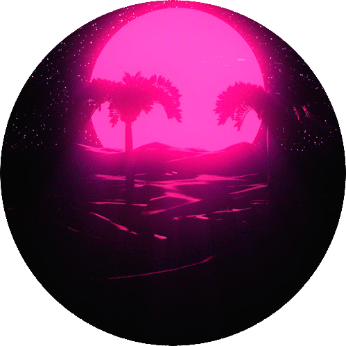

<!-- markdownlint-disable MD014 -->
<!-- markdownlint-disable MD026 -->
<!-- markdownlint-disable MD033 -->
<!-- markdownlint-disable MD041 -->

# Hi, I'm Gustavo Morinaga 🤟🏼

👨🏻‍💻 Full-Stack | Design | UI | UX

👨‍🎓 Internet Systems Technologist Certificate at [Fatec São Roque](https://www.fatecsaoroque.edu.br)

💼 Full-Stack Developer at [ADV Tecnologia](https://www.advtecnologia.com.br)

## About me

- 🧑🏻 I'm 22 years old
- 🏠 I live in São Roque, SP, Brazil
- 🌎 I'm from Isesaki, Gunma, Japan
- 🌱 Studying hard to become a good Full-Stack Developer
- 👯 I want to collaborate on open-source JavaScript projects
- 💬 Ask me something! I love to answer them
- 🎞️ Lover of films, cartoons and nerdy culture
- 🎮 I love playing video games
- 🎸 In my spare time I play electric guitar
- 🎧 I love listening to Metal, Synthwave and old songs (60' ~ 90')
- 💎 I have a habit of adjusting and improving projects

### Languages, Libraries and Frameworks

 
 
 
 
 
 
 
 
 
 
 
 
 
 
 
 
 
 
 
 
 
 
 
 

### Tools

 
 
 
 
 
 
 
 
 
 
 
 
 
 
 
 
 
 
 
 
 

## Stats

### Thanks for the visit! I hope we can networking ❤️

## Translations

<kbd></kbd>
<kbd></kbd>
