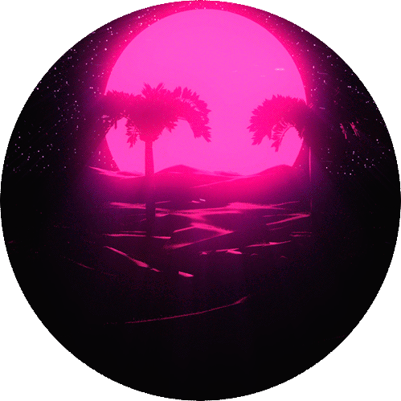
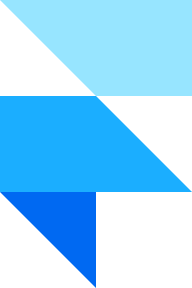

<!-- markdownlint-disable MD014 -->
<!-- markdownlint-disable MD026 -->
<!-- markdownlint-disable MD033 -->
<!-- markdownlint-disable MD041 -->

# Olá, eu sou Gustavo Matheus 🤟🏼

👨🏻‍💻 Full-Stack | Design | UI | UX

👨‍🎓 Estudante na FATEC São Roque [5/6]

💼 Desenvolvedor Full-Stack na ADV Tecnologia

## Sobre mim

- 🧑🏻 Tenho 21 anos
- 🏠 Moro em São Roque, SP, Brasil
- 🌎 Nasci em Isesaki, Gunma, Japão
- 🌱 Estudando bastante para virar um bom dev Full-Stack
- 👯 Quero colaborar em projetos open-source de JavaScript
- 💬 Me pergunte algo! Adoro respondê-las
- 🎞️ Apreciador de filmes, desenhos e cultura nerd
- 🎮 Adoro jogar video games
- 🎸 Nas horas vagas toco guitarra
- 🎧 Amo ouvir Metal, Synthwave e músicas antigas (60' ~ 90')
- 💎 Tenho costume de ajustar e aprimorar projetos

### Linguagens, Bibliotecas e Frameworks

 
 
 
 
 
 
 
 
 
 
 
 
 
 
 
 
 

### Ferramentas

 
 
 
 
 
 
 
 
 
 
 
 
 
 
 
 

## Status e Estatística

### Obrigado pela visita! Espero que possamos fazer networking ❤️

## Traduções

<kbd></kbd>
<kbd></kbd>
